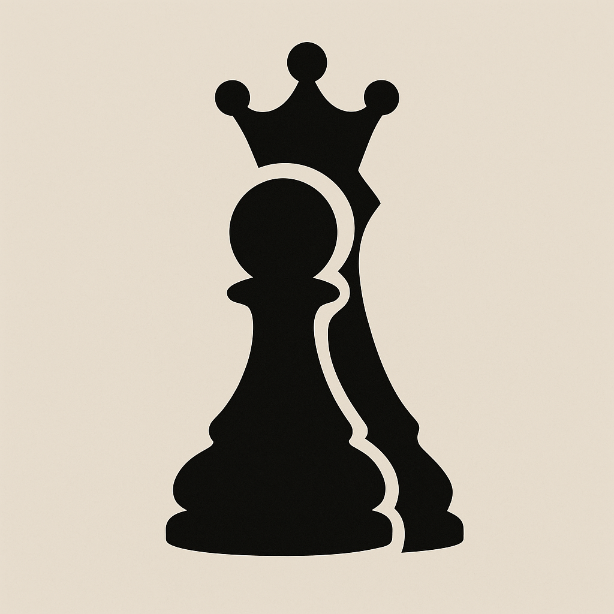

<p align="center">
  
</p>

<h1 align="center"><i>Pawn2Queen</i></h1>
<p align="center"><i>Transformer-powered Chess AI</i></p>
<br>

*Pawn2Queen* is a personal project that combines my passion for chess with Machine Learning. It leverages Transformer architectures, Reinforcement Learning and Knowledge Distillation to develop a chess AI.\
The name reflects the journey of a humble pawn becoming a queen in chess. It also symbolizes my learning process to master state-of-the-art AI techniques.

## 🚀 Project goals
The project is focused on creating a chess AI using modern techniques while serving as a space for personal growth in fields such as:
- **Transformer architectures**: GPT-style models for chess positions or move generation
- **Reinforcement Learning**: Training an agent to play chess through self-play and fine-tuning with RLHF
- **Knowledge Distillation**: Compressing large, complex models into smaller, efficient ones

Although primarily an educational project, my goal is to eventually **deploy the bot on Lichess**, where it can play against real opponents.\
By doing so, I hope to gain insights into the strengths and weaknesses of the model, which can be used to further improve it through additional training and fine-tuning (and learning for me!).


## 🚧 Project status

This project is a **work in progress**.
For a detailed history of changes, refer to the [CHANGELOG.md](CHANGELOG.md) file.

## 🛠️ Installation

This project uses Python and is managed with `pyproject.toml`. To set up the environment, follow these steps:

1. Clone the repository:
   ```bash
   git clone https://github.com/jacoporepossi/Pawn2Queen.git
   cd Pawn2Queen
   ```

2. Install dependencies:
    ```bash
    pip install .
    ```
    If you plan to develop or contribute, install the package in editable mode:
    ```bash
    pip install -e .
    ```

4. Set up the configuration file to use Stockfish as the chess engine:
    - Download the Stockfish binary from the [official website](https://stockfishchess.org/download/).
    - Rename `config.template.yaml` to `config.yaml`
    - Update the `config.yaml` file in the root directory with the path to the Stockfish binary. For example:
    ```yaml
    stockfish_path: "C:/path/to/stockfish.exe"
    ```


## 📂 Project structure

```bash
Pawn2Queen/
├── README.md
├── pyproject.toml
├── config.yaml            # Configurations
├── src/                   # Source code
│   ├── evaluate/          # Evaluation scripts
│   ├── models/            # Model architectures and implementations
│   ├── train/             # Training scripts
│   └── utils/             # Utility functions and helpers
├── tests/                 # Unit tests and integration tests
└── notebooks/             # Jupyter notebooks for human play, experimentation and analysis
```

## ✨ Features

- **Play Against AI**: Play chess against a Transformer-powered AI or Stockfish
- **Customizable Levels**: Adjust the AI's skill level using Stockfish's UCI options
- **Model Evaluation**: Evaluate custom models against Stockfish at various levels
- **Training Framework**: Scripts for training and fine-tuning models using Reinforcement Learning

## 📊 Evaluation

The project includes an evaluation pipeline to test the AI against Stockfish at different levels. Use the following command to evaluate a model:

```bash
python src/evaluate/evaluate.py --levels 1 2 3 --rounds 50 --model_name RandomChessBot
```

- `--levels`: Stockfish levels to evaluate against (e.g., 1, 2, 3)
- `--rounds`: Number of games to play per level and color
- `--model_name`: Name of the model to evaluate

## 🧠 Models

Here are the models currently implemented in the project and their match statistics against Stockfish at different levels. The evaluation was performed using 500 games for each color, for a total of 1000 games per level.
The statistics, taken from [this reference](https://www.chessprogramming.org/Match_Statistics), are as follows:
- **Wins**: Number of games won by the model, $w$
- **Losses**: Number of games lost by the model, $l$
- **Draws**: Number of games drawn by the model, $d$
- **Win Ratio**: Ratio of wins to total games played, calculated as $(w + \frac{d}{2})/n$, where $n$ is the total number of games played
- **Draw Ratio**: Ratio of draws to total games played
- **Likelihood of Superiority (LOS)**: Calculated using the formula $0.5*[1 + erf((w - l)/√(w + 2l))]$, it refers to the statistical chance that one player (or engine) has a higher probability of winning against another, based on their rating difference or match results


**RandomChessBot**: a simple bot that makes random moves. It serves as initial baseline for testing.

| Stockfish strength | Wins  | Losses | Draws | Win Ratio |Draw Ratio | LOS  |
| :------------:     | :---: | :----: | :---: | :------:  | :------:  |:---: |
| 1                  | 2     | 735    | 263   | 13.4%     | 26.3%     | 0%   |
| 2                  | 0     | 796    | 204   | 10.2%     | 20.4%     | 0%   |
| 3                  | 0     | 1000   | 0     | 0%        | 0%        | 0%   |
| 4                  | 0     | 1000   | 0     | 0%        | 0%        | 0%   |
| 5                  | 0     | 1000   | 0     | 0%        | 0%        | 0%   |
| 6                  | 0     | 1000   | 0     | 0%        | 0%        | 0%   |
| 7                  | 0     | 1000   | 0     | 0%        | 0%        | 0%   |

**NeuralChessBot** a simple neural network-based bot that uses a feedforward neural network to evaluate positions and select moves (coming soon).\
**TransformerBot**: a transformer-based bot that uses a transformer architecture to evaluate positions and select moves (coming soon).

## 🧪 Playground

It is possible to play against the AI using the `play_vs_computer.ipynb` notebook in the `notebooks/` directory, allowing you to either select the trained models or Stockfish as the opponent.
